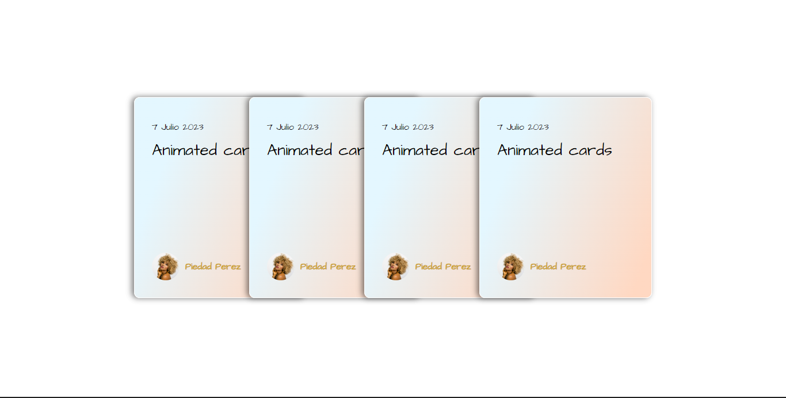

# 4 Animated cards 


## Table of contents

- Useful resources #HTML and CSS
- Author #Maribel Mena
- Acknowledgments #animation with css


### Screenshot

()

### Links


- Live Site URL: [Add live site URL here](https://codepen.io/may74062545/pen/WNYZgNx)


### Built with

- Semantic HTML5 markup
- CSS custom properties
- Flexbox


```html
<div class="card element2">
    <div class="header">
        <div class="date">7 Julio 2023</div>
        <div class="title">Animated cards</div>
    </div>
    <div class="footer">
        <div class="autor">
            <a href="#">
                
                <span>Piedad Perez</span>
            </a>
        </div>
    </div>
</div>
```
```css
.cards-container .card:hover {
    margin-right: 80px;
    transform: rotate(3deg) translateY(-15px);

}

```


